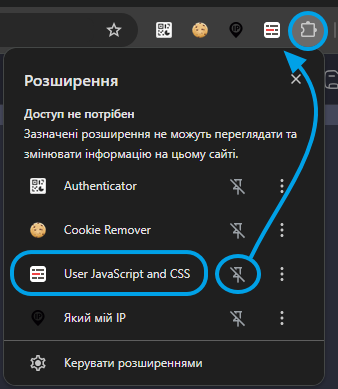
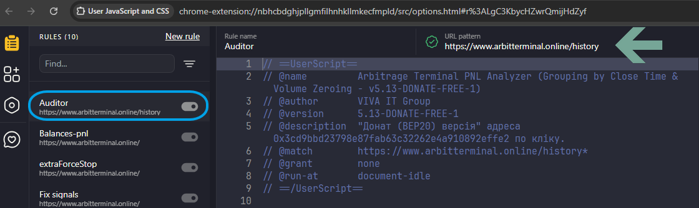
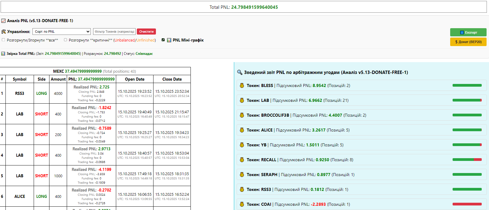

# 📈 ArbiTerminal PNL Auditor (v5.18)

**Розширений аудит PNL, групування за часом закриття та звірка обсягів для ArbiTerminal.**

Цей скрипт-аудитор **автоматично** збирає ваші угоди, об'єднує їх в арбітражні позиції на основі близькості часу закриття та нульового обсягу, а також надає деталізований звіт про їхню ефективність.

---

## 🚀 Встановлення (Chrome/Edge)

Цей скрипт є **Userscript** і вимагає спеціального розширення для його запуску у вашому браузері. Ми використовуємо розширення **"User JavaScript and CSS"** як простий менеджер для скриптів.

### Крок 1: Встановлення розширення "User JavaScript and CSS"

1.  Відкрийте Chrome Web Store.
2.  Знайдіть і встановіть розширення **"User JavaScript and CSS"**.
    * [**Посилання для Chrome**](https://chromewebstore.google.com/detail/user-javascript-and-css/nbhcbdghjpllgmfilhnhkllmkecfmpld)



### Крок 2: Відкриття Редактора Скриптів

1.  Перейдіть на сторінку історії PNL, де має працювати скрипт:
    ```
    https://www.arbitterminal.online/history
    ```
2.  Натисніть на іконку розширення **"User JavaScript and CSS"** у правому верхньому куті браузера.
3.  Відкриється вікно редактора. **Переконайтеся**, що ви перебуваєте на вкладці **"JavaScript"**.


### Крок 3: Копіювання та Вставка Коду

1.  **Скопіюйте повний вміст** файлу [`auditor-5.18.js`](https://github.com/Vax-int/auditor/blob/main/auditor-5-18.js) з цього репозиторію. 
    * *(Ви можете скопіювати його з початкового файлу або перейти до нього на GitHub і натиснути "Raw" для зручного копіювання.)*
2.  **Вставте** скопійований код у поле редактора JavaScript розширення.



### Крок 4: Збереження та Активація

1.  Натисніть кнопку **"Save"** (Зберегти) у вікні розширення.
2.  Переконайтеся, що перемикач **"Enable"** (Увімкнути) у верхній частині вікна **активний** (зазвичай, синього кольору).


### Крок 5: Запуск Аудиту

1.  **Оновіть** сторінку `https://www.arbitterminal.online/history`.
2.  Якщо у вас є угоди, скрипт автоматично відобразить зведений звіт PNL та елементи керування **праворуч** від оригінальних таблиць при увімкненому Show Detailed info.



---

## 📝 Основний Функціонал Аудитора

Аудитор здійснює зведення та аналіз ваших угод, ідентифікуючи арбітражні позиції на основі їхнього закриття.

| Функція | Опис |
| :--- | :--- |
| **Групування за Close Time** | Угоди об'єднуються в позицію, якщо час їхнього закриття різниться не більше ніж на **15 секунд**. |
| **Звірка Обсягу (Volume Zeroing)** | Перевіряє, чи сумарний обсяг (Long/Short) у згрупованій позиції близький до нуля. |
| **Статуси Позицій** | **Closed (Matched/Stitched)** – успішно спаровано; **Unfinished Position** – не спаровано (<24 год); **Unbalanced** – не спаровано (>24 год). |
| **Звірка Total PNL** | Розраховує загальний PNL на основі зшитих позицій та звіряє його з PNL на сайті, виконуючи **автоматичний retry** у разі розбіжностей. |
| **Експорт у CSV** | Дозволяє вивантажити детальний звіт для подальшого аналізу. |

---

## ❤️ Підтримка Проекту (Донат BEP20)

Цей інструмент надається безкоштовно. Якщо він допоміг вам заощадити час або виявити переваги чи помилки, ви можете підтримати подальший розвиток проєкту.

У блоці керування Аудитора з'явиться спеціальна кнопка:

**🟡 $ Донат (BEP20)**

Натискання на цю кнопку автоматично копіює адресу гаманця BEP20 (Binance Smart Chain):
